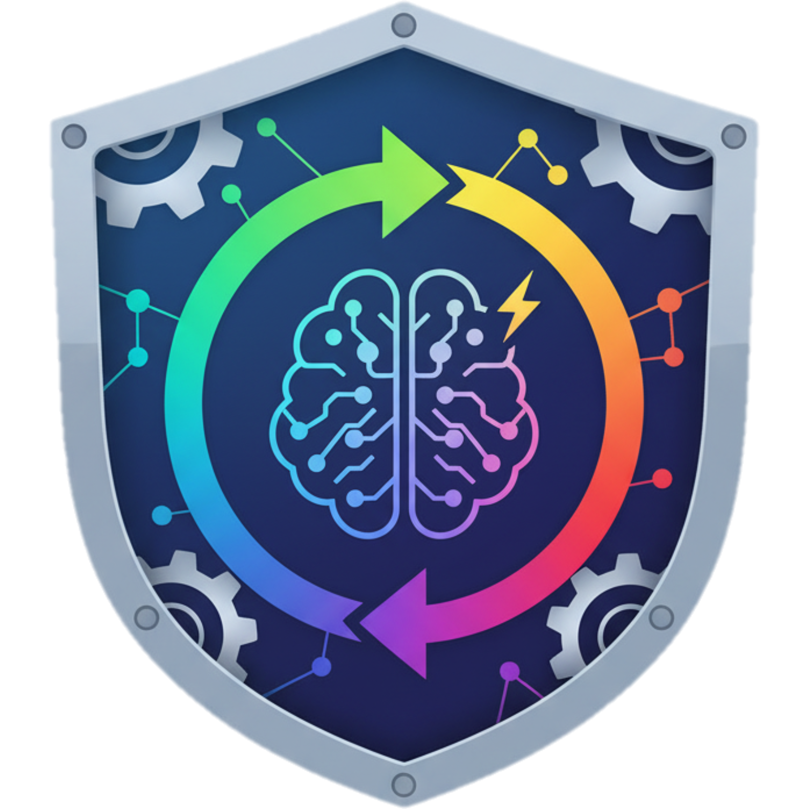

# AI-Status

<div align="center">
  
  <h3>Cross-platform desktop app to monitor AI service availability</h3>
  <p>Get instant notifications when AI services are blocked or restored</p>
</div>

## 🌟 Features

- **Real-time Monitoring**: Continuously checks major AI service endpoints (OpenAI, Anthropic, Google Gemini, Cohere, Hugging Face)
- **System Tray Integration**: Runs quietly in the background with color-coded status indicator
  - 🟢 Green = All services online
  - 🟡 Yellow = Partial access
  - 🔴 Red = All services offline
- **Smart Notifications**: Get alerted when AI access changes
- **Custom Endpoints**: Add your own services to monitor
- **History & Analytics**: Track uptime over time with visual graphs
- **Export Logs**: Download history as JSON or CSV
- **Auto-start**: Launch on system boot
- **Dark Mode**: Automatic light/dark theme support

## 🚀 Quick Start

### Prerequisites

- Node.js 18+ and npm
- macOS or Windows

### Installation

1. **Clone the repository**
   ```bash
   git clone https://github.com/AltusRossouw/AI-Status.git
   cd AI-Status
   ```

2. **Install dependencies**
   ```bash
   npm install
   ```

3. **Run in development mode**
   ```bash
   npm run dev
   ```

   This will:
   - Start the Vite dev server for the renderer process (port 3000)
   - Compile the main process TypeScript
   - Launch Electron

### Building for Production

#### Build for your current platform
```bash
npm run package
```

#### Build for macOS only
```bash
npm run package:mac
```

#### Build for Windows only
```bash
npm run package:win
```

Built applications will be in the `dist/` folder.

## 🎨 Design

- **Primary Color**: `#1D33F3` (Blue)
- **Font**: Inter (loaded from Google Fonts)
- **UI Framework**: React + TailwindCSS
- **Icons**: System tray icons change color based on status

## 🧰 Tech Stack

- **Electron**: Cross-platform desktop framework
- **TypeScript**: Type-safe development
- **React**: UI components
- **TailwindCSS**: Utility-first styling
- **Recharts**: Data visualization
- **Vite**: Fast build tool

## 📁 Project Structure

```
AI-Status/
├── src/
│   ├── main/                  # Electron main process
│   │   ├── main.ts           # App entry, window & tray management
│   │   ├── preload.ts        # Context bridge
│   │   └── services/
│   │       ├── pingService.ts      # AI endpoint checking logic
│   │       └── settingsManager.ts  # Settings persistence
│   └── renderer/             # React UI
│       ├── App.tsx           # Main app component
│       ├── main.tsx          # React entry point
│       ├── index.css         # Global styles
│       ├── types.ts          # TypeScript definitions
│       └── components/
│           ├── TitleBar.tsx        # Custom window controls
│           ├── StatusView.tsx      # Service status display
│           ├── SettingsView.tsx    # Settings panel
│           └── HistoryView.tsx     # History & analytics
├── assets/                   # App icons and images
├── dist/                     # Built files (generated)
├── package.json
├── tsconfig.json            # Renderer TS config
├── tsconfig.main.json       # Main process TS config
├── vite.config.ts          # Vite configuration
└── tailwind.config.js      # TailwindCSS configuration
```

## ⚙️ Configuration

The app stores settings in:
- **macOS**: `~/Library/Application Support/ai-status/settings.json`
- **Windows**: `%APPDATA%\ai-status\settings.json`

### Default Settings

```json
{
  "checkInterval": 60,
  "notificationsEnabled": true,
  "autoStart": false,
  "customEndpoints": []
}
```

## 🔧 Development

### Available Scripts

- `npm run dev` - Run in development mode
- `npm run build` - Build main and renderer processes
- `npm run build:main` - Build main process only
- `npm run build:renderer` - Build renderer process only
- `npm run package` - Build and package for current platform
- `npm run package:mac` - Build macOS app (.dmg, .zip)
- `npm run package:win` - Build Windows app (.exe, portable)

### Adding Custom AI Services

Edit `src/main/services/pingService.ts` and add to the `services` array:

```typescript
{
  name: 'Your Service',
  url: 'https://api.yourservice.com/health',
  status: 'checking',
  latency: null,
  lastChecked: null
}
```

## 🎯 How It Works

1. **Ping Service**: Makes HEAD requests to AI service endpoints every 30-60 seconds
2. **Status Detection**: Considers HTTP responses < 500 as "online" (even 401/403 means service is reachable)
3. **Change Detection**: Compares current status with previous check
4. **Notifications**: Triggers system notifications on status changes
5. **Tray Updates**: Changes tray icon color to reflect overall status
6. **History Tracking**: Stores up to 1000 check results for analytics

## 🐛 Troubleshooting

### App won't start
- Ensure Node.js 18+ is installed
- Delete `node_modules` and run `npm install` again
- Check console for errors

### Notifications not working
- Grant notification permissions in system settings
- Ensure "Enable Notifications" is checked in app settings

### Build fails
- Make sure all dependencies are installed
- Check that TypeScript compiles without errors: `npm run build:main`
- Verify Vite build works: `npm run build:renderer`

## 📄 License

MIT License - see LICENSE file for details

## 🙏 Credits

Built with ❤️

---

**Note**: This app performs network checks to public endpoints. No API keys or authentication is transmitted. The app simply verifies if services are reachable.
